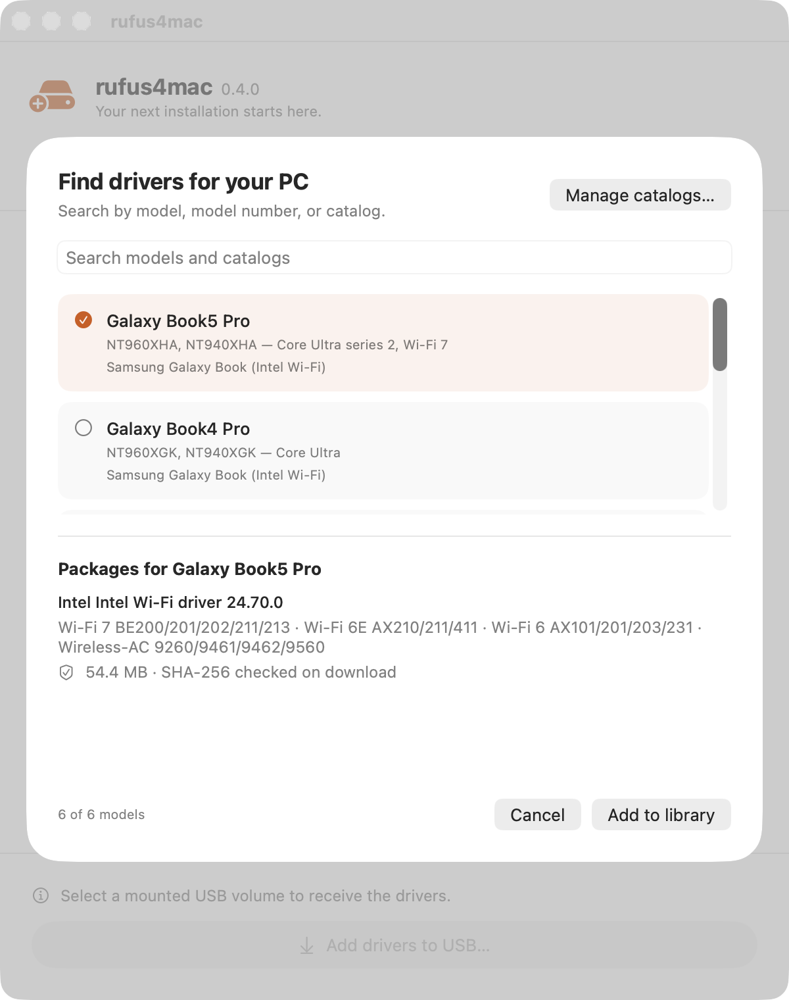

# rufus4mac

Create bootable USB drives on macOS — a [Rufus](https://rufus.ie)-style tool for Mac.
Write Linux/general disk images **and** Windows 10/11 install media, with progress and
verification. Native Swift + SwiftUI; no background daemon, no Full Disk Access.

  

## Install

Download `rufus4mac-<version>.dmg` from the
[**Releases**](https://github.com/hulryung/rufus4mac/releases) page, open it, and drag
**RufusApp** to Applications. **macOS 13+** (Apple Silicon or Intel). Signed with a Developer ID
and notarized by Apple, so it launches without Gatekeeper warnings.

## Usage

1. **Choose…** an image (`.iso`, `.img`, `.dmg`). Windows ISOs are detected automatically.
2. Pick the target USB under **Target disk** (internal disks are never listed).
3. **Write** → confirm → enter your password at the one-time macOS prompt.
4. Watch the progress to **Done**.

> ⚠️ Writing erases the entire target disk. Double-check the selection.

Select an image and click **Compute checksums** to see its MD5 / SHA-1 / SHA-256 (handy for verifying
a download against a published hash).

For Windows ISOs you can preset **Windows User Experience** options, applied via a generated
`autounattend.xml`: bypass Windows 11 checks (TPM/Secure Boot/RAM/CPU), create a local account,
skip privacy questions, match this Mac's region & language, and disable BitLocker auto-encryption.

### Carrying drivers

A machine whose Wi-Fi driver is missing cannot download one — Samsung's own support pages tell you to
fetch the driver on another PC and bring it over on a USB stick. rufus4mac puts it on the same stick
as the installer. Pick a Windows ISO and the **Drivers to carry** section appears, with three ways to
fill it:

| | |
|---|---|
| **From catalog…** | Choose your Galaxy Book from the list. rufus4mac downloads the driver and checks it against the vendor's published SHA-256. |
| **Add files…** | Point at an installer or a whole extracted driver folder you already have. |
| **From link…** | Paste a download link and name the model. |

Tick the models you want and write — they are copied to `Drivers/<model>/` on the stick, then
size-checked like the image itself. **Windows Setup does not touch them:** the folder is deliberately
not `$WinPEDriver$`, so nothing is installed during setup. Run the installer once Windows is up.

The library lives in `~/Library/Application Support/rufus4mac/Drivers`, one folder per model, so
**Show in Finder** and drop files in if you prefer — the filesystem *is* the catalogue.

#### What the catalog covers

  

| Model | Model numbers |
|---|---|
| Galaxy Book5 Pro | `NT960XHA`, `NT940XHA` |
| Galaxy Book4 Pro | `NT960XGK`, `NT940XGK` |
| Galaxy Book3 Pro | `NT960XFG`, `NT940XFG` |
| Galaxy Book2 Pro | `NT950XED`, `NT950XEV`, `NT930XED` |
| Galaxy Book2 | `NT750XED`, `NT550XED` |
| Other Intel Galaxy Book | any Intel model |

The catalog is keyed on the **chipset**, not the model. Samsung has no stable per-model download URL,
but Intel does, and one Intel package drives every Intel Wi-Fi adapter from Wireless-AC 9560 through
Wi-Fi 7 — which is every Intel-based Galaxy Book. So the model list only helps you find your machine;
it does not decide the file, and an entry that is missing cannot give you the wrong driver. Pick
**Other Intel Galaxy Book** if yours is not listed.

> Snapdragon models (**Galaxy Book Go**, **Galaxy Book4 Edge**) are deliberately absent. Their Wi-Fi
> is Qualcomm, and the Intel package cannot drive it.

#### Other machines, other catalogs

The bundled list is one file. **Add from catalog… → Manage…** installs more from a file or an https
link, and updates them in place — so a catalog for your own fleet can be written once, hosted
anywhere, and kept current by everyone using it.

Because a catalog names executables that will be run on a fresh Windows install, every package must
carry an https URL and the publisher's SHA-256; downloads are checked against it and discarded on
mismatch. A catalog missing that does not load. See
[**docs/driver-catalogs.md**](docs/driver-catalogs.md) for the format and for how to pick packages
that stay correct.

**Format mode:** select no image and the button becomes **Format** — erase a USB as **exFAT** or
**FAT32** with **MBR/GPT** and a volume label.

## Roadmap

| Phase | Scope | Status |
|-------|-------|--------|
| **1 — MVP** | Device + image selection, raw/DD write to USB, verify | ✅ done |
| **2 — Windows media** | UEFI Windows 10/11 install USB (FAT32 + `install.wim` split, Win11 bypass) | ✅ done |
| **3 — Format options** | Format-only mode: MBR/GPT + exFAT/FAT32 + volume label (NTFS/cluster/bad-block deferred) | ✅ done |
| **4 — Extras** | ISO downloader, Linux persistence, checksums, localization | planned |

## Docs

- [Architecture & internals](docs/ARCHITECTURE.md) — how it works, build & test, packaging
- [Manual test checklist](docs/manual-test-checklist.md)
- Design specs & implementation plans: [`docs/superpowers/`](docs/superpowers/)

## License

TBD
