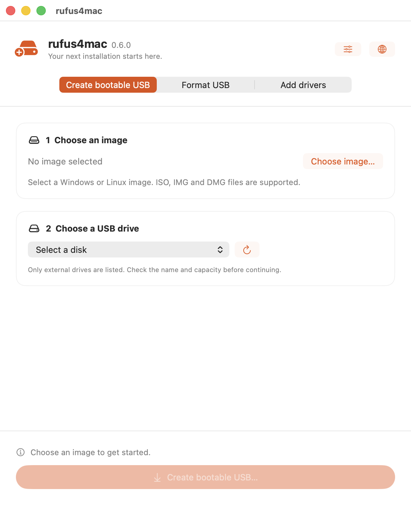
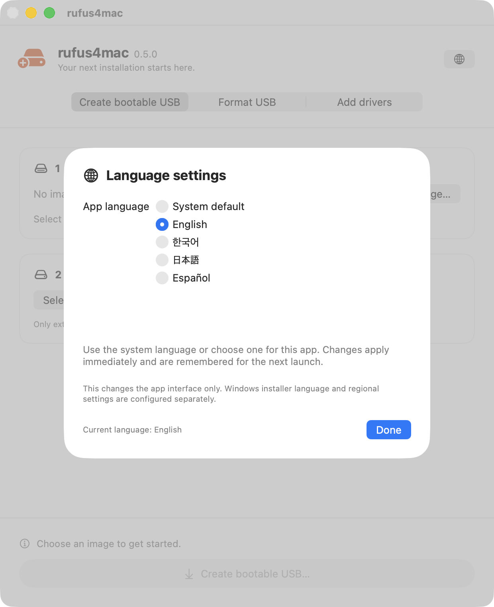
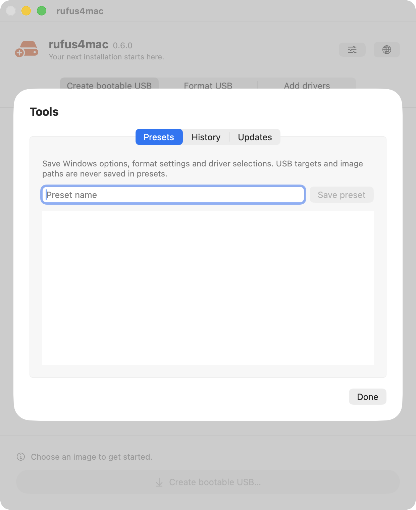
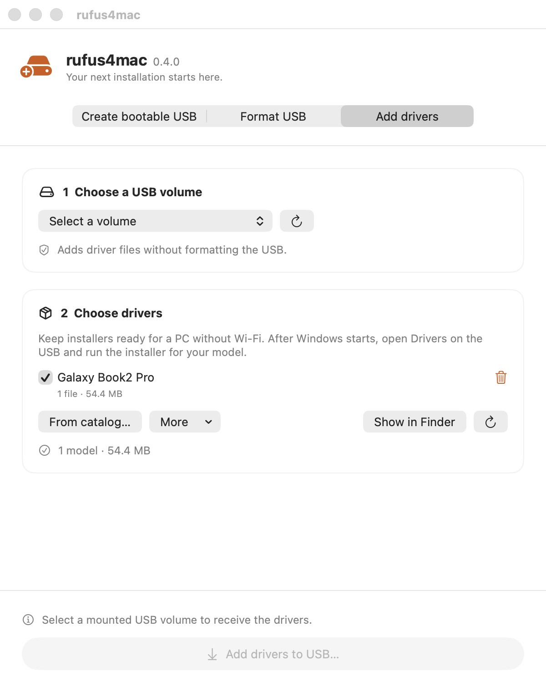
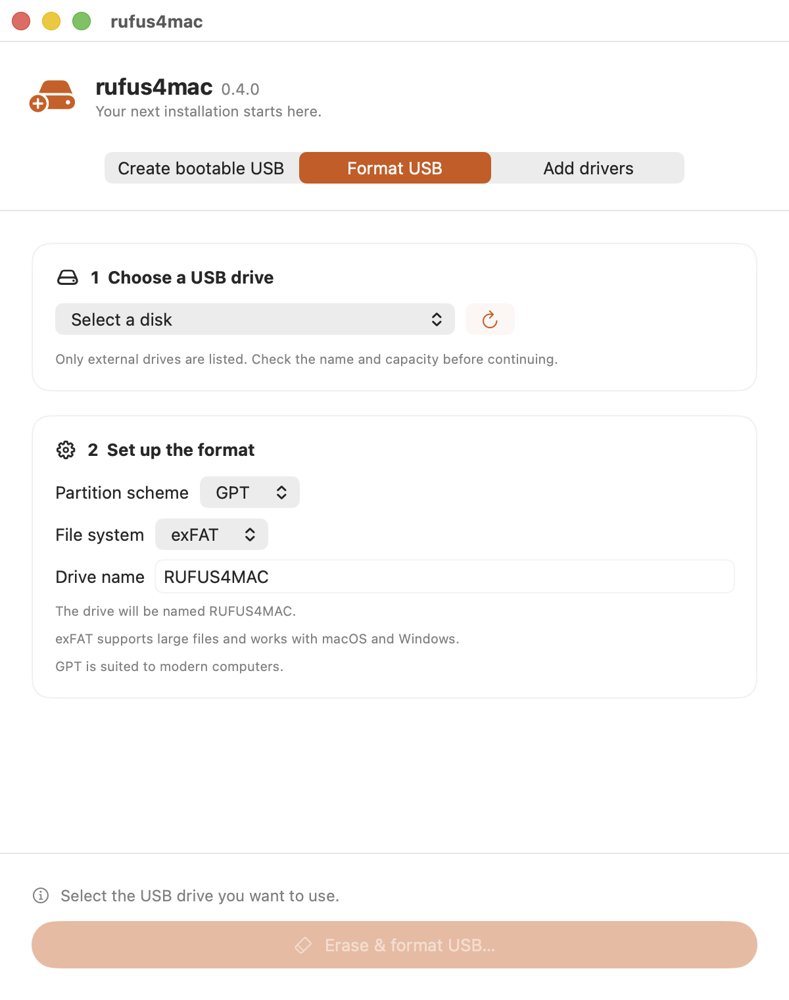

# rufus4mac

**Create bootable USB drives, format removable media, and carry Windows drivers — from a Mac.**

rufus4mac is a native SwiftUI app inspired by [Rufus](https://rufus.ie). It writes Linux and other
raw disk images, builds Windows 10/11 installation USBs, and helps you bring driver installers to
a PC that cannot get online yet.

<p align="center">
  
</p>

[Download the latest release](https://github.com/hulryung/rufus4mac/releases/latest) ·
[Release notes](https://github.com/hulryung/rufus4mac/releases/tag/v0.6.0) ·
[Build from source](docs/ARCHITECTURE.md#build--test)

## Install

1. Download the latest **rufus4mac DMG** from [Releases](https://github.com/hulryung/rufus4mac/releases/latest).
2. Open the DMG and drag **RufusApp** onto **Applications**.
3. Launch RufusApp from Applications. When updating, quit the previous version before replacing it.

The downloadable build requires **macOS 13 or later on Apple Silicon**. The app and its bundled
wimlib are signed with a Developer ID; the DMG is notarized by Apple. No Homebrew installation,
background daemon, or Full Disk Access grant is needed to use the release.

Intel Macs are not supported by this prebuilt DMG. An Intel build from source needs a matching
Intel build of wimlib. The architecture of the **Mac running the app** is separate from the PC
that will use the USB: choose installation media and drivers appropriate for that PC.

## What's new in 0.6.0

- **Automatic USB detection:** available drives update when you connect, disconnect or mount a device.
- **Better driver downloads:** byte progress, cancellation, two automatic retries for temporary failures,
  and a manual retry action. Valid packages already in the library are reused.
- **Named presets:** save Windows preferences, format settings and selected driver models for next time.
- **Persistent history:** keep the latest 100 tasks locally and export individual JSON reports.
- **Safe cancellation:** stop copying or verification at a safe boundary, with guidance for the USB afterward.
- **Update checks:** check the latest stable GitHub release from the app and open its download page.

All new controls support English, Korean, Japanese and Spanish.

## What's new in 0.5.0

- **Four UI languages:** English, Korean, Japanese and Spanish, with system detection and a saved language override.
- **Review before starting:** inspect the target, image, Windows options and driver selection together.
- **Attachment checks:** revalidate the selected disk before writing, including when macOS reuses a disk number.
- **Task reports:** save the original settings, success or failure, and diagnostic details as JSON.
- **Recovery guidance:** understandable next steps alongside technical errors.

### Task-based workflow introduced in 0.4.0

- **Three explicit tasks:** create bootable media, format a USB, or add drivers to an existing USB.
- **A clearer workflow:** numbered setup cards, a fixed action/progress area, and explanations of
  what is needed before you can start. The app uses a single main window.
- **One shared driver library:** use it independently or enable **Include drivers on this USB**
  when making a new Windows installer.
- **Searchable catalogs:** find models by name, model number, or catalog; long descriptions wrap
  and growing model/package lists scroll independently.
- **More visible checks:** copy image hashes, preview the actual formatted drive name, and see
  input/read errors. Setup controls are locked while checking an image or running a task.

## App language

The app supports **English, 한국어, 日本語, and Español**. By default it follows macOS's preferred
languages, falling back to English when no supported language matches. Open the **globe button** or
press **⌘,** to choose a language or return to **System default**. The selection applies immediately
and is remembered on the next launch.

This changes the app UI, not the Windows installer language or the target PC's regional settings.
Catalog contents and external-tool diagnostics retain their original text. See
[Adding languages and managing translation resources](docs/localization.md) for the JSON configuration.



## Review and task reports

Before starting, a scrollable review lists the selected USB and image, the normalized format name,
Windows setup options, and included driver models. Erasing a disk requires the explicit final action;
USB attachment identity is checked again before handing the task to a writer.

After a task finishes, use the share button beside the language button to save its JSON report.
The report retains the original task options even if you switch tasks afterward. It includes the
image filename and any diagnostic error text, so review it before sharing. The latest 100 tasks are
saved on this Mac and remain available in **Tools → History** after restarting. A task is recorded
when it starts; **Unfinished** means the app stopped before it recorded a final result. No report
is uploaded automatically. **Clear history…** removes local records, keeping USB files and exported reports.

## Presets and updates



Open the **sliders button** beside the globe to access Tools:

- **Presets:** enter a name and save the current Windows options, verification preference, format
  settings and selected driver models. **Apply** restores them. Image paths and USB targets are
  deliberately omitted, so choose the destination for every task. Missing driver models are reported;
  a preset does not download packages or start a write.
- **History:** inspect completed, failed/cancelled or unfinished tasks and export their reports.
- **Updates:** click **Check for updates** to query GitHub's latest stable release. If a newer version
  exists, open its release page. Downloading and installation remain explicit actions; there is no
  automatic background update check.

Presets and history are stored as `presets.json` and `history.json` under
`~/Library/Application Support/rufus4mac`. If a file cannot be read, the app reports the error
and keeps it instead of silently replacing it.

## Cancelling a task

During image writing, Windows media creation or driver copying, use **Cancel task…** and review
its confirmation. Keep the USB connected until the task stops. Copying and verification check
for cancellation between chunks; a running format or WIM split finishes before cancellation
continues. Format-only tasks cannot be interrupted from the app.

A cancelled media-creation task can leave an incomplete USB: eject it in Finder and recreate the
media before using it. Cancelling **Add drivers** preserves existing USB files and removes unfinished
staging files; complete model folders published before cancellation can remain. Inspect these folders
before retrying, because the app will not overwrite an existing model folder.

## Choose a task

| Task | Use it for | Effect on existing USB data |
|---|---|---|
| **Create bootable USB** | Write an image or build Windows install media | Erases the entire selected disk after confirmation |
| **Format USB** | Prepare an empty exFAT or FAT32 drive | Erases the entire selected disk after confirmation |
| **Add drivers** | Copy driver installers onto a mounted USB | Keeps existing files; refuses conflicting model folders |

**Before creating or formatting a USB, back up its contents and check the device name and capacity.**
The target lists exclude internal/system disks. You still choose the external disk yourself.

## Create a bootable USB

1. Select **Create bootable USB** and click **Choose image…**. Supported file extensions are
   `.iso`, `.img`, and `.dmg`. Wait for the image check to finish.
2. Connect the USB and choose it when it appears automatically. The refresh button is also available.
3. Review the options, then click **Create bootable USB…** and confirm the disk to erase.
4. Follow progress in the footer. Raw image writing uses a macOS authorization prompt.
5. Wait for **Your USB is ready** and follow the ejection guidance before unplugging.

### Windows installation media

Windows ISOs are detected automatically. rufus4mac creates **MBR/FAT32** install media for UEFI
boot, copies the installation files, and splits oversized `install.wim` files into `.swm` parts.
It checks copied file sizes and split parts before reporting success, then ejects the USB.

Expand **Windows setup preferences** to configure:

- Windows 11 compatibility-check bypasses.
- Skipping privacy questions.
- Regional settings based on this Mac; the installation language follows the ISO.
- Disabling automatic BitLocker encryption.
- A local administrator account. Enter a username when this option is enabled; the generated
  account initially has a blank password, so set a password after installation.

Turn on **Include drivers on this USB** to select installers from your driver library. They are
copied to `Drivers/<model>/` alongside the Windows installation files.

The bundled wimlib splitter is the default. The built-in splitter under **Advanced** remains
experimental: it has automated compatibility checks but still needs a real Windows installation
validation. Leave it off for the standard workflow.

### Linux and other disk images

Other images are written byte-for-byte. Keep **Verify after writing** enabled to read the result
back and compare its SHA-256 with the source. Verification takes additional time.

The image determines the USB's partition layout and filesystems. Selecting a supported file
extension does not guarantee the image is bootable on your target computer. Driver files are not
appended to raw-written images; use **Add drivers** afterwards only if the result has a writable,
suitable volume.

### Check a downloaded image

Expand **Image checksums** and click **Compute checksums** to calculate MD5, SHA-1, and SHA-256.
Each result has a copy button. Compare the full value against one published by the image provider;
computing a hash alone does not establish that a download is authentic.

Progress percentages and remaining-time estimates refer to the **current step**. Copying,
splitting, and verification have different speeds, so the percentage can restart at a new step.

## Add drivers to an existing USB

<p align="center">
  
</p>

1. Select **Add drivers** and choose a mounted, writable external volume.
2. Add driver files to the library using one of the methods below, then select the models to carry.
3. Click **Add drivers to USB…** and confirm. The app stages the files and checks their sizes
   before placing them in `Drivers/<model>/`.
4. Eject the USB in Finder. On the Windows PC, open the relevant model folder and run its installer.

| Library action | What it does |
|---|---|
| **From catalog…** | Downloads the selected model's packages and checks the publisher-provided SHA-256 |
| **More → From files…** | Imports local installers or whole extracted driver folders |
| **More → From link…** | Downloads a file from a supplied link into a named model folder |
| **Show in Finder** | Opens the library so you can inspect its files |

Downloads show transferred bytes and a percentage when the server provides a total size. Use
**Cancel download** to stop; **Retry** starts another attempt. Temporary network failures and HTTP
408/429/5xx responses receive up to two automatic retries. Other HTTP errors and checksum mismatches
are reported immediately. Previously verified catalog packages are reused on retry. A replacement
is committed only after downloading and verification succeed, preserving any prior library file.

**These files are carried, not automatically installed.** They are not injected into Windows Setup
or installed on your Mac. Catalog hashes are checked against the catalog's declared values; only
import catalogs and links from sources you trust. Direct-link imports do not have a catalog hash
to compare against.

This task does **not** format the USB. If `Drivers/<model>/` already exists, the app stops rather
than replacing it; rename or move that folder in Finder before adding the model again. If a copy
is interrupted, some new model folders may already be present. Existing files remain untouched.
Use a Windows-readable volume such as **FAT32 or exFAT** when taking installers to a PC.

The library is shared between this task and Windows USB creation. It lives at
`~/Library/Application Support/rufus4mac/Drivers`, with one folder per model. Selecting models in
the library does not include them in a new installer unless **Include drivers on this USB** is on.

## Driver catalogs that grow with your devices

<p align="center">
  
</p>

The bundled catalog lists Intel-based Galaxy Book 2 through 5 models plus a general Intel Galaxy
Book entry. It carries an Intel Wi-Fi package; it is **not a complete Samsung driver suite**.
Snapdragon/Qualcomm models such as Galaxy Book Go and Galaxy Book4 Edge are not covered by that package.

Use **From catalog… → Manage catalogs…** to add JSON catalogs from a file or HTTPS URL, update them,
or remove user-added catalogs. Search matches model names, model numbers, and catalog names. Model
lists and package details adapt to the file's contents; no model-specific UI changes are required.
Invalid catalogs are reported while valid ones remain available.

Catalogs declare package URLs, versions, sizes, coverage descriptions, and SHA-256 hashes.
See [Writing and sharing driver catalogs](docs/driver-catalogs.md) for the format and an example.
Installed catalogs live in `~/Library/Application Support/rufus4mac/Catalogs`.

## Format a USB

<p align="center">
  
</p>

Select **Format USB**, choose a target, and set its partition scheme, filesystem, and drive name.
The app previews the normalized name that will actually be written. Click **Erase & format USB…**
to review and confirm the operation. Eject the drive in Finder afterwards.

- **exFAT:** supports large files and works with macOS and Windows.
- **FAT32:** useful for older devices; individual files must be smaller than 4 GiB.
- **GPT / MBR:** choose the partition scheme appropriate for the devices that will use the drive.

This is a quick format. NTFS formatting, secure erasure, bad-block scans, and custom cluster sizes
are not implemented. Switching tasks preserves the selected image; an empty image selection never
silently switches the app into format mode.

## Troubleshooting and limits

- **USB missing:** reconnect it and refresh. Add drivers requires an already-mounted, writable
  volume; a read-only filesystem will not appear in that list.
- **Start button disabled:** read the footer for the missing selection, pending image check,
  insufficient space, or required input.
- **A copy or verification fails:** keep the error details, check the connection and free space,
  and try again with a reliable port or drive. Do not treat a failed write as bootable media.
- **Driver folder conflict:** move or rename the existing model folder in Finder, then retry.
- **Boot compatibility:** Windows media targets UEFI. Legacy BIOS Windows media, automatic driver
  injection, ISO downloading, and Linux persistence are not implemented.

Automated tests exercise core behavior and synthetic disk images. They do not replace an end-to-end
boot and installation test on the destination PC. See the [manual checklist](docs/manual-test-checklist.md)
for hardware validation that remains outstanding.

## Development and documentation

```sh
swift test
xcodegen generate
xcodebuild -project rufus4mac.xcodeproj -scheme RufusApp \
  -destination 'platform=macOS' CODE_SIGNING_ALLOWED=NO build
```

- [Architecture, build instructions, and release packaging](docs/ARCHITECTURE.md)
- [Driver catalog format](docs/driver-catalogs.md)
- [Manual verification checklist](docs/manual-test-checklist.md)

The source tree does not yet declare a project-wide license. The built-in WimSplit module has its
own [MIT license](Sources/WimSplit/LICENSE). Releases bundle [wimlib](https://wimlib.net/); its upstream
license notices are included in the app's `Contents/Resources/wimlib` directory.
