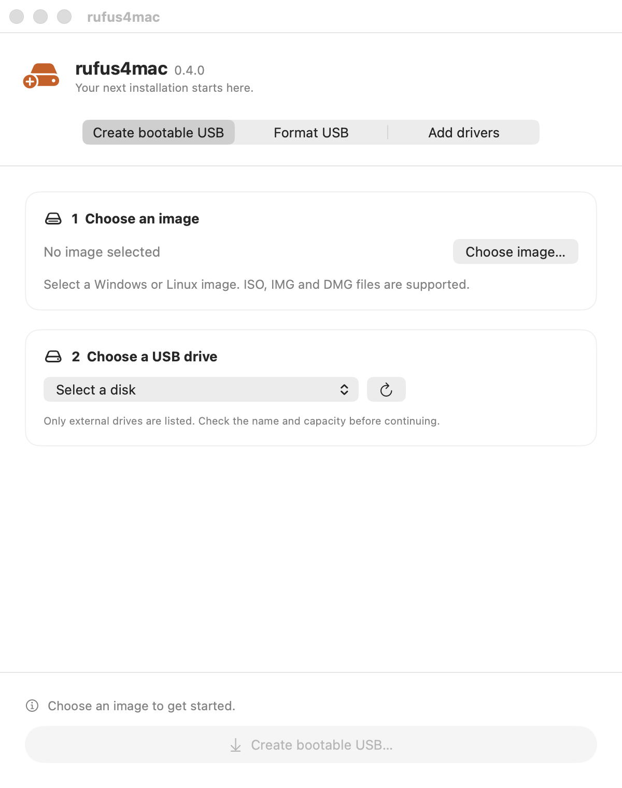

# rufus4mac

Create bootable USB drives on macOS — a [Rufus](https://rufus.ie)-style tool for Mac.
Write Linux/general disk images **and** Windows 10/11 install media, with progress and
verification. Native Swift + SwiftUI; no background daemon, no Full Disk Access.

  

## Install

Download `rufus4mac-<version>.dmg` from the
[**Releases**](https://github.com/hulryung/rufus4mac/releases) page, open it, and drag
**RufusApp** to Applications. **macOS 13+** (Apple Silicon or Intel). Signed with a Developer ID
and notarized by Apple, so it launches without Gatekeeper warnings.

## Usage

1. **Choose…** an image (`.iso`, `.img`, `.dmg`). Windows ISOs are detected automatically.
2. Pick the target USB under **Target disk** (internal disks are never listed).
3. **Write** → confirm → enter your password at the one-time macOS prompt.
4. Watch the progress to **Done**.

> ⚠️ Writing erases the entire target disk. Double-check the selection.

For Windows ISOs, an optional **"Bypass Windows 11 compatibility checks"** toggle handles
TPM/Secure Boot/RAM/CPU requirements.

**Format mode:** select no image and the button becomes **Format** — erase a USB as **exFAT** or
**FAT32** with **MBR/GPT** and a volume label.

## Roadmap

| Phase | Scope | Status |
|-------|-------|--------|
| **1 — MVP** | Device + image selection, raw/DD write to USB, verify | ✅ done |
| **2 — Windows media** | UEFI Windows 10/11 install USB (FAT32 + `install.wim` split, Win11 bypass) | ✅ done |
| **3 — Format options** | Format-only mode: MBR/GPT + exFAT/FAT32 + volume label (NTFS/cluster/bad-block deferred) | ✅ done |
| **4 — Extras** | ISO downloader, Linux persistence, checksums, localization | planned |

## Docs

- [Architecture & internals](docs/ARCHITECTURE.md) — how it works, build & test, packaging
- [Manual test checklist](docs/manual-test-checklist.md)
- Design specs & implementation plans: [`docs/superpowers/`](docs/superpowers/)

## License

TBD
